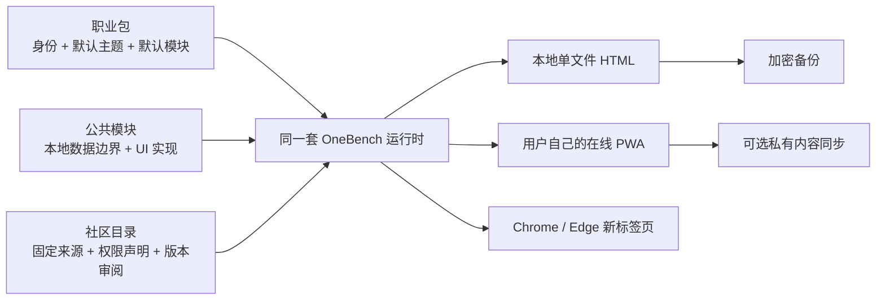

# 一句工作台 / OneBench

> 不会搭网站也没关系。说一句“我是谁、最想管什么”，就得到一份当天能开始使用的工作台。

OneBench 是开源、配置驱动、本地优先的个人工作台底座。它不是空白看板生成器：每个职业包都带自己的主题、首页结构、场景模块、真实示例内容和可操作状态。默认生成可双击打开的单文件 HTML 与桌面快捷方式；需要手机、多电脑和长期迭代时，再升级到用户自己的私有仓库与线上 PWA。

## 直接体验

[打开 OneBench Demo](https://diyiwuyan.github.io/onebench/)：打开就是一份真实可操作的“考研 180 天冲刺台”。左侧是日历、待办、记录、目标等应用入口，首页是可拖拽、可变尺寸的小组件画布；每个职业包会自动搭配第一屏，其余模块收进侧栏。所有示例计划都能新增、改名和删除，而不是写死的展示数据。它与下载到电脑的 HTML、手机 PWA、浏览器新标签页使用同一套工作台代码。

## 第一次使用：不需要懂技术

1. 第一次打开会出现 3 个问题：身份、最想管理的事、使用设备；提交后立即生成一份完整工作台。
2. 如果只用电脑，点“下载本地版”，得到一个可放到桌面、双击打开的完整 HTML。
3. 如果电脑和手机都用，引导会直接打开手机添加说明；之后再由智能体升级为你自己账号下的在线 PWA。
4. 生成后可从“市场”添加模块，模块会直接出现在首页；也可以点“一句话修改”继续调整。

详细说明见 [给第一次使用的人](docs/BEGINNER.md)。想交给智能体，直接复制 [一句发给智能体](docs/AGENT-STARTER.md)。

## 三种使用方式

| 方式 | 适合谁 | 用户得到什么 |
| --- | --- | --- |
| 默认本地版 | 只在一台电脑使用、不会技术的用户 | 独立 HTML 文件和桌面快捷方式；双击打开，内容留在本机。 |
| 私有同步版 | 需要手机或多台电脑的用户 | 自己账号下的线上 PWA 与私有数据仓库；选择后才同步日常内容。 |
| 浏览器新标签页 | 常在 Chrome／Edge 工作的用户 | 加载 `dist/extension` 后，每次打开新标签页就是工作台。 |

## 基础版与专业版

基础版继续提供职业包、模块市场和自由拖拽，适合第一次使用与通用管理。点击顶部“选择专业版”完成第一次选择；进入专业版后，版本切换、返回基础版、称呼、紧凑布局和数据备份统一收进左下角“设置”，主界面不再出现版本切换器。现有四套版本拥有独立布局、导航、数据和核心交互：

- 考公专业版：可改考试日期；新增并更正行测题量、正确数和用时；套卷复盘保存年份、正确率和结论；错题按下次复习日形成二刷队列；申论记录字数、用时、得分和下一步。
- 教师专业版：新增、编辑学生与关注状态，录入成绩并自动算均分，跟踪作业提交，登记／处理考勤，记录家校沟通和下一步，管理谈话／纪律，并点击两名学生交换座位。
- 生活创作旗舰版：按公开案例的六个核心页面建立移动端工作流：每日计划、窄抽屉、五阶段小提琴路线／阶段详情、每日灵感、热点／挑战二创。每日计划可增删改勾选；10 条每日灵感和热点二创可筛选、收藏并直接流转为创作任务；作品复盘会自动计算收藏率；备忘录支持搜索与归档；小提琴路线会在完成当前阶段练习后才解锁下一阶段，英语拥有独立练习与公开资源入口。该版本是受公开案例启发的 OneBench 原创实现，不复制原作者的人物、素材、代码或原文内容。
- 创作者专业版：可编辑每日推进，把选题推进到制作和发布，安排发布档期，记录播放／收藏复盘，并调整 OKR 进度。

专业版数据分别保存在本机，切换版本不会覆盖基础版；设置内支持“下载此版本到电脑”、JSON 导入、导出与恢复示例。下载的 HTML 会带上当前专业版与其数据，双击仍直接进入相同版本；本地与用户自有线上仓库也可用 `--edition exam|teacher|hu|creator` 直接生成指定版本。公开案例、互动证据和复刻边界见 [专业版设计来源](docs/PROFESSIONAL-EDITIONS.md)。

## 一键拥有，而不是只拿到一个临时链接

使用 `onebench-deploy` Skill 的智能体必须交付用户自己账号下的完整仓库、`workspace.json`、自动部署工作流和可打开的网址；不能只交一个临时平台链接或静态文件夹。以后只需说“帮我改成……”，智能体就在该仓库修改、测试并自动更新网页。完整规则见 [用户拥有权](docs/OWNERSHIP.md)。

每个用户仓库都能保留 OneBench 官方上游，公共模块和模板目录通过固定来源、版本与权限声明进行更新；目录不会在浏览器中静默执行第三方代码。见 [社区目录与贡献](docs/COMMUNITY.md)。

## 首期职业／学习包：选什么，会得到什么

| 你是谁 | 默认主题 | 默认帮你理顺什么 |
| --- | --- | --- |
| 大学生 | 校园晴空 | 课程、作业 DDL、考证、阅读与身心状态 |
| K12 教师 | 黑板鼠尾草 | 课表、备课、班级事项、教研沟通与复盘 |
| 考研 | 冲刺暖杏 | 倒计时、真题、错题、公告、专注与阶段目标 |
| 考公 | 上岸政务蓝 | 行测申论、刷题、公告报名、专注与复盘 |
| 内容创作者 | 创作珊瑚 | 灵感收件箱、创作流水线、发布日历与数据复盘 |
| 产品／运营 | 产品石墨 | 需求收件箱、项目节点、会议、决策与周报 |
| 自由职业者 | 独立橄榄 | 客户项目、收入回款、个人节奏与专注 |
| 团队负责人 | 管理雾紫 | 团队目标、会议、决策、项目与管理复盘 |
| 财务 | 账本琥珀 | 记账、发票、回款、客户与财务汇总 |
| 家有宝宝 | 育儿暖绒 | 喂养、健康、生日、日记与家庭提醒 |
| 职场办公 | 办公雾青 | 日程、会议、项目、资料与智能简报 |
| 销售／商务 | 商务暖铜 | 客户机会、跟进、合同与回款 |
| 个体经营 | 小店青玉 | 客户、订单、收支、发票与现金流 |
| 求职／转行 | 求职靛蓝 | 岗位、投递、面试、学习与作品集 |
| 银发生活 | 安心暖阳 | 健康、用药、日历、天气与家人提醒 |

每个包都会先装入日历、天气、待办、快速记录、习惯打卡、个人资料、主题、同步和设置；再加入与身份真正相关的内容。当前内置 51 个可组合模块、15 套职业主题。切换职业包时，主题、首页首屏、引导语、默认模块和示例内容一起切换；用户仍可单独换主题、叠加备考／健身／家庭／财务月结等场景，不需要重新搭页面。

首页布局会保存在 `workspace.json`：组件可拖拽排序，并可在小号、中号、大号之间切换；“移到侧边栏”只改变入口位置，不删除任何个人数据。天气组件通过 Open-Meteo 主动联网更新，失败时继续显示上次缓存，离线 HTML 仍可正常使用其他模块。

模块市场离线内置官方模块，并可联网读取 OneBench 公共目录。模块会明确标记“手动记录、自动计算、联网更新、外部连接、智能体”能力和数据边界，支持搜索和按类型筛选。目录条目声明来源、固定版本、所需权限和模块组合；浏览器不会直接执行陌生远程代码。经过 PR 审阅的源码随 OneBench 版本进入用户自己的项目，个人配置和日常数据仍由用户掌握。

联网模块不会要求用户手工编新闻：GitHub Actions 每两小时汇总经过登记的中文公开 RSS，网页从自己的域名读取资讯快照，再按身份和主题在本地筛选；每条资讯显示来源、时间和原文链接，断网时保留最近结果。公共 RSS 直接读取同源快照；自定义 RSS 在带 Worker 的在线版中由同源接口读取，纯静态版则只直连允许跨域访问的订阅源，不再依赖临时免费转换代理。RSS、汇率、公开 GitHub 动态支持用户主动连接。日历和书签支持导入 `.ics` 与浏览器书签 HTML。智能简报只读取本工作台已有内容，在用户打开工作台后按计划生成。详见 [公共资讯与 RSS](docs/LIVE-DATA.md)。

## 开源生态怎么组成



- 想贡献一个职业版本：提交职业包、主题、默认模块和桌面／手机截图。
- 想只贡献一种首页排布或视觉：分别提交布局模板或主题包，不必复制整个职业包。
- 想贡献一个模块：登记模块 ID、数据边界与 UI 实现，再进入公共目录。
- 想更新公共能力：联网刷新目录元数据，审阅固定版本源码，通过完整测试后再合并。
- 想保留自己的修改：用户仓库跟踪 OneBench 上游；升级时保留 `workspace.json` 与本地数据边界。

## 给智能体的一句话：只填两处

复制下面一段，把 `【身份】` 和 `【想管理的事】` 换掉即可。不会精确填写也没关系：写“学生”和“学习”可以生成；但写成“大学生，课程、作业和考证”会更贴合。

```text
请使用 OneBench 开源方案帮我搭建个人工作台：
https://github.com/diyiwuyan/onebench/tree/main/skills/onebench-deploy

我是【身份】，最想管理【想管理的事】。请先生成并验收一份完整可用的本地工作台；我还要在手机上使用，请再升级为我自己账号下的在线版。我不懂 GitHub、部署和模块，请由你处理。完成后只告诉我：电脑怎么打开、手机怎么添加到桌面、以后怎么修改这三件事。
```

可直接照抄的示例：`我是大学生，最想管理课程、作业和考证。` 或 `我是退休教师，最想把每天的待办和资料理清楚。`

## 当前已实现

- `workspace.json` v1 协议与模块注册表
- 15 个职业／学习场景包、15 套联动主题、51 个内置模块
- 左侧应用导航与可拖拽、可变尺寸、可持久化的首页小组件画布
- 可编辑的职业示例数据，以及带本地缓存的日历、天气和新闻资讯组件
- 自动计算的生日倒计时、生理期预测、每日语录和财务收支汇总
- RSS、公开汇率、GitHub 动态、浏览器书签和 `.ics` 日历导入
- 模块能力分类、搜索筛选、场景叠加和每日智能简报
- 本地保存的称呼、头像／照片、工作台名称与主题设置
- 真实可操作的职业工作台、单文件离线 HTML 与桌面快捷方式
- 同一套运行时输出 Demo、本地 HTML、在线 PWA 与浏览器新标签页
- 本地保存、AES-GCM 加密迁移包、日常数据的可选私有同步
- GitHub Contents API 拉取／推送配置（仅配置，不上传私密任务数据）
- 职业包、布局、主题、模块组合、单模块五类投稿规范，公共目录快照与 JSON Schema
- 模块数据边界协议与可分发的 `onebench-deploy` 智能体 Skill

## 新标签页扩展

除了网页和手机桌面，OneBench 也可成为 Chrome／Edge 的浏览器新标签页。执行 `npm run build:extension`，再加载 `dist/extension` 即可。详细步骤见 [浏览器扩展](docs/BROWSER-EXTENSION.md)。

## 社区目录

- 目录协议：`packages/community-registry/registry.json`
- 校验目录：`npm run validate:registry`
- 从公共仓库刷新目录：`npm run update:registry`
- 贡献模板／模块：[社区目录与贡献](docs/COMMUNITY.md)
- 在线投稿说明：[五类模板与模块投稿](docs/TEMPLATE-SUBMISSION.md)

## 开发

```bash
npm install
npm run dev
```

## GitHub 同步

创建 Fine-grained personal access token，仅授予目标仓库的 **Contents: Read and write** 权限。Token 仅保存在当前浏览器的本地存储中；公共演示环境请不要填写真实 token。

## 连接器边界

默认联网模块只读取公开数据并保留本地缓存；RSS 只能读取用户主动填写的地址；GitHub 只读取公开活动；书签和日历文件只在浏览器本地解析。需要同步个人内容时，仍然必须由用户主动开启自己的私有仓库同步。
